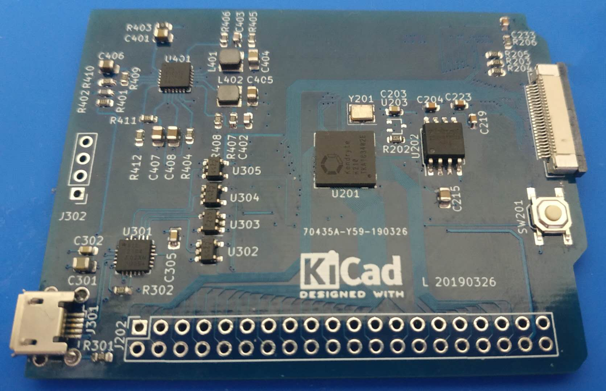

# _KiteRF_

[](https://travis-ci.org/ATmega8/kiterf "build")

[](https://github.com/ATmega8/kiterf/releases/latest/ "release")
[](https://github.com/ATmega8/kiterf/issues "issues")

_KiteRF is a SDR system with K210 & FPGA & ESP32 as its core controller, which make SDR more intelligent, portable and cheap._

* KiteRF Structure

  

  * DS (Digital Signal) unit

    * FPGA (Field-Programmable Gate Array)

      * Radio Frequency Data Processing

      * DS Control

      * Communication with PC

    * K210 (Kendryte K210)

      * LCD control

      * Camera control

      * Audio

      * FFT

    * ESP32 (Espressif ESP32)

      * Wi-Fi Data Transmission

      * SDCARD control

      * Touch Button

      * RGB LED Control

  * RF (Radio Freqency) unit

    * ADC (Analog-to-Digital Converter)
    
      * Sampling Analog Baseband IQ Data

    * DAC (Digital-to-Analog Converter)

      * Output Analog Baseband IQ Data 

    * RF Transceiver

      * Mixing IF signal to baseband and outputting IQ analog signal

    * VCO (Voltage-Controlled oscillator)

      * Provide local IF frequency

    * Mixer (Frequency mixer)

      * Mixing HF signal to IF signal

    * LNA (Low-Noise Amplifier)

      * Suppression of Mirror Noise Signal

    * RF Switch

      * Switching signal paths in different frequencies

* KiteRF coreborad v1.0.0

  

## Contents


* Directory tree

    ```
    ├── add_path.sh
    ├── data
    │   ├── kiterf_1.0.0.jpg
    │   ├── kiterf_structure.pos
    │   └── kiterf_structure.svg
    ├── docs
    │   ├── kendryte_datasheet.pdf
    │   └── kendryte_freertos_programming_guide.pdf
    ├── LICENSE
    ├── project
    │   ├── code
    │   │   ├── ESP32
    │   │   └── K210
    │   └── pcb
    │       ├── ESP32
    │       ├── K210
    │       └── RF
    ├── README.md
    └── tools
        ├── ESP32
        │   ├── esp-idf
        │   └── xtensa-esp32-elf
        └── K210
            ├── kendryte-freertos-sdk
            ├── kendryte-toolchain
            └── kflash
    ```

    * project

      * PCB project (KiCAD)

      * FPGA project (ISE)

      * ESP32 project (esp-idf)

      * K210 project (Kendryte FreeRTOS)

    * release

      * PCB gerber

      * FPGA bin

      * ESP32 bin

      * K210 bin

    * tools

      * script

      * sdk

      * toolchain

## How to use

* clone

  ```bash
  git clone --recursive https://github.com/ATmega8/kiterf
  cd kiterf
  ```

  * note

    Don't omit `--recursive`, because we use submodule.

* update

  ```bash
  git pull
  git submodule update --init --recursive
  ```

* Install toolchain

  * K210

    * Ubuntu/Debian/Kali

      ```bash
      wget https://s3.cn-north-1.amazonaws.com.cn/dl.kendryte.com/documents/kendryte-toolchain-ubuntu-amd64-8.2.0-20190213.tar.gz
      tar zxvf kendryte-toolchain-ubuntu-amd64-8.2.0-20190213.tar.gz -C tools/K210/
      rm kendryte-toolchain-ubuntu-amd64-8.2.0-20190213.tar.gz
      ```
    
    * Arch

      ```bash
      wget https://www.kiterf.xyz/download/kendryte-toolchain-arch-amd64-8.2.0-20190415.tar.gz
      tar zxvf kendryte-toolchain-arch-amd64-8.2.0-20190415.tar.gz -C tools/K210/
      rm kendryte-toolchain-arch-amd64-8.2.0-20190415.tar.gz
      ```

  * ESP32

    * Ubuntu/Debian/Kali/Arch

      ```bash
      wget https://dl.espressif.com/dl/xtensa-esp32-elf-linux64-1.22.0-80-g6c4433a-5.2.0.tar.gz
      tar zxvf xtensa-esp32-elf-linux64-1.22.0-80-g6c4433a-5.2.0.tar.gz -C tools/ESP32/
      rm xtensa-esp32-elf-linux64-1.22.0-80-g6c4433a-5.2.0.tar.gz
      ```

* Add environment variables

  ```bash
  . add_path.sh
  ```
  * note

    Don't forget `"."`

## License

[](LICENSE)

* MIT License
 
  A short and simple permissive license with conditions only requiring preservation of copyright and license notices. Licensed works, modifications, and larger works may be distributed under different terms and without source code.

## Contributing


If you want to support this project, we hope you can contribute your code or circuit.
